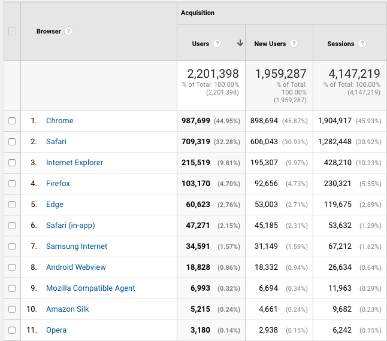
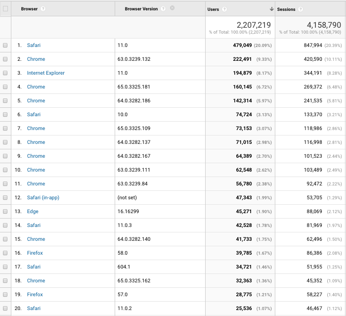

# 🌻 Janis ☮️

Janis is the codename for the software that renders [https://alpha.austin.gov](alpha.austin.gov) for web browsers. It is a working prototype of static site generation front-end and decoupled CMS architecture.

Janis uses data provided by the CMS API service, [Joplin](https://github.com/cityofaustin/joplin), along with the React components to generate a static-progressive website.

## Table of Contents

* [Getting Started](#getting-started)
* [Project Info](#project-info)
* [Design](#design)
* [Frameworks and Libraries Used](#frameworks-and-libraries-used)
  * [React-Static](#react-static)
  * [Storybook](#storybook)
* [Browser Compatibility](#browser-compatibility)
* [Other Documentation for Developers](#other-documentation-for-developers)
* [Adding dependencies via yarn](#adding-dependencies-via-yarn)
* [Updating translation export via yarn](#updating-translation-export-via-yarn)
* [Static build script](#static-build-script)
* [Sass Code Style Guidelines](#sass-code-style-guidelines)
* [Accessibility Guidelines](#accessibility-guidelines)

## 😃 Getting Started

In order to run Janis locally you need to [install Docker](https://docs.docker.com/install/#supported-platforms). Our team uses Docker for Mac.

Once Docker is installed and you've cloned the code from this repository, you can run the "serve-local" Shell script below to spin up a Docker container and install dependencies within a virtualized environment that replicates the production environment in our Heroku deployment.

#### As a React App (Developer Mode):

```
./scripts/serve-local.sh
```

Your react app should be running at http://localhost:3000/

**As a static build**
To run the site locally as a static build, the way it works in production, see the [Static build script](#static-build-script) section below.

## Project Info

This work began under the Austin Digital Services Discovery Project. Design, Technology, and Innovation Fellows worked in partnership between two City departments, Communications Public Information and Communications and Technology Management.

We set out to learn what’s working for other government service providers, then embark on an iterative research, prototyping, and testing process to identify new designs, methods, and technologies.

More high level information about the project from content strategy, user research and design, and development teams is continually updated on [our project page](http://projects.austintexas.io/projects/austin-digital-services-discovery/about/what-we-are-doing/).

## 🎨 Design

Current design mockups are stored in Google Drive as Sketch Files:
https://drive.google.com/drive/u/1/folders/1Xg6739ixhIDrb7MdJAnO4_zCRu3kDmZQ

## Frameworks and Libraries Used

Here are some high-level notes about the open source technologies we are using for this project.

For more information about the concepts and architectural decisions guiding this work, take a break from this README and check out some of what we have written on Medium and our project page:

* https://medium.com/civiqueso/open-source-city-cms-part-1-607a58b32356
* http://projects.austintexas.io/projects/austin-digital-services-discovery/about/Dev/
* http://projects.austintexas.io/projects/austin-digital-services-discovery/our-technical-approach/open-by-default/

### ⚛️ React-Static

This project uses [React-Static](https://github.com/nozzle/react-static) as a base framework for building static-progressive React applications and websites. It's designed with considerations for SEO, site performance, and user/developer experience.

### 🌍 React-Intl

This project uses [React-Intl](https://github.com/yahoo/react-intl/) to format dates and numbers and handle translations of static content. Some details of our current implementation to be aware of follow:

* the formatMessage() react-intl API method will return unescaped HTML. We can utilize this method to render translations of trusted content which include HTML (but do not include React components).
ex. The 311 Section Header includes HTML links.

* the FormattedMessage react-intl component will parse React components from values. We can utilize this method to render translation which have React components as parameters.
ex. The footer body text include ExternalLink components.

### 📚 Storybook

* Storybook is a development environment for UI components. It allows you to browse a component library, view the different states of each component, and interactively develop and test components.
* To run Storybooks locally:
  * `./scripts/serve-storybook.sh`
  * open http://localhost:6006/

### 💅🏼 Prettier

[Prettier](https://prettier.io/) is an opinionated code formatter that integrates with most editors. You press save and code is formatted.

To set up Prettier check out their [editor integrations](https://prettier.io/docs/en/editors.html).

## Browser Compatibility

Following the lead of other government digital services groups ([USWDS](https://github.com/uswds/uswds/issues/2071), [UK GDS](https://gds.blog.gov.uk/2012/01/25/support-for-browsers/)), we're committing to support browsers that represent > 2% of all site traffic recorded in Google Analytics for visitors to austintexas.gov.

Based on data from 1/1/2018 to 4/16/2018 these are the browsers with > 2% of all site traffic that we commit to support. This list will be reevaluated again when we drop the `alpha.` subdomain.

* Safari 10 and above
* Chrome 63 and above
* Internet Explorer 11 and above
* Edge 16 and above
* Firefox 58 and above

Here are Google Analytics screenshots from data range 1/1/2018 to 4/16/2018.

#### Top Browsers as of 2018-04-16



#### Top Browsers by version number as of 2018-04-16



As this project moves forward, we hope to implement even more comprehensive Browser Support guidelines following the examples of other government agencies like the [cfpb](https://github.com/cfpb/development/blob/master/guides/browser-support.md).

### Manual Testing with BrowserStack

Our team uses BrowserStack to manually check for device and browser compatibility. Our checklist of devices includes (subject to update):

**Mobile**

* iPhone 6S Safari & Chrome
* Galaxy S7 Chrome & Samsung Internet
* Galaxy Note8 Chrome
* Google Pixel Chrome

**Tablet**

* iPad 4 Safari
* Windows Tablet IE 11
* Kindle Fire HDX 7

**Desktop**

* Windows 7
  * IE 11
  * Firefox 57
  * Chrome 63
* Windows 10
  * Edge 16
  * IE 11
  * Chrome 63
  * Firefox 57
* MacOS
  * Safari 11
  * Chrome 63
  * Firefox 57

---

## Other Documentation for Developers

### Adding dependencies via yarn

This will update your container's yarn.lock and package.json files.
Your local host machine's yarn.lock and package.json files will also be updated via mounted docker volumes. These local files are versioned and should be checked into git.

Add a package via yarn (https://yarnpkg.com/lang/en/docs/cli/add/)

```
docker exec --interactive --tty janis yarn add <package name>
```

Note: if you're running the docker container built by serve-build.sh you'll have to update the container name from `janis` to `janis-build` in the above command.

### Updating translation export via yarn

All static translations live in src/js/i18n/locales/ directory.
These files are versioned and built from the auto-generated default.json file (within that directory) via [babel-plugin-react-intl](https://github.com/yahoo/babel-plugin-react-intl).
To re-generate default.json to update the static content to be translated, the following command can be run:

```
docker exec --interactive --tty janis yarn run build-langs
```

Note: if you're running the docker container built by serve-build.sh you'll have to update the container name from `janis` to `janis-build` in the above command.

### Static build script

Since we use React-Static as our framework to render our React components as a static progressive website, it's important for us to be able to test the final static build locally. In order to do this, we have a script.

**To build and serve**

```
./scripts/serve-build.sh
```

Your site will be running on http://localhost:8080/

## SASS Guidelines

We're using BEM for CSS naming and organization

* our css is namespaced with coa-
* our css classes should stack. EX. a blue button would look like `<button class="coa-button coa-button--blue">Button</button>`.
* class names for js components should correspond with the js component name(capitalized and camelCased).
  * EX. LinkList.js markup has styles applied via the class names `coa-LinkList coa-LinkList--boxprimary`.
* class names which are not js components but have multiple words should be separated by a -
  EX. `coa-Footer__body-text`

Resources:

* http://getbem.com/introduction/

### Accessibility Guidelines

One advantage for using React components is that we can write reusable HTML-rendering modules that never forget about proper attribute tagging and ARIA labels.

For example, we learned that when we use `target="_blank"` on an anchor tag, we should add `aria-label="Opens in new window"` and `rel="noopener noreferrer"` for [security](https://www.jitbit.com/alexblog/256-targetblank---the-most-underestimated-vulnerability-ever/). Now we have a reusable `<ExternalLink>` component.

more a11y Resources:

* http://wave.webaim.org/
* https://www.w3.org/WAI/WCAG20/quickref/
* [Accessibility section of "Front-End Checklist"](https://github.com/thedaviddias/Front-End-Checklist#accessibility)
* https://cfpb.github.io/design-manual/best-practices/accessibility-best-practices.html
* https://github.com/cfpb/development/blob/master/guides/accessibility.md
* https://developers.google.com/web/fundamentals/accessibility/how-to-review
* [How we’ve made GOV.UK Elements even more accessible](https://accessibility.blog.gov.uk/2018/02/28/how-weve-made-gov-uk-elements-even-more-accessible/) and https://accessibility.blog.gov.uk/ in general
* https://accessibility.18f.gov/
* https://developer.mozilla.org/en-US/docs/Learn/Accessibility
